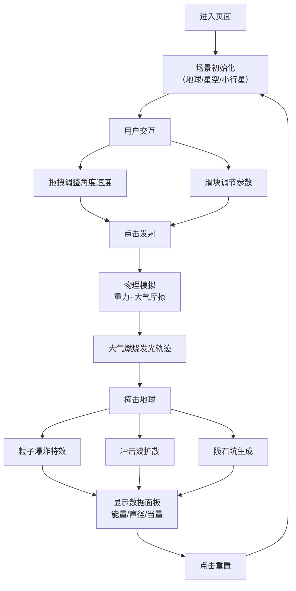

## 1. 产品概述

小行星撞击地球3D模拟器，通过可视化的方式让用户直观感受小行星撞击的物理过程和能量释放。用户可调节陨石大小、速度和入射角度，观察大气摩擦燃烧、爆炸冲击和陨石坑形成的全过程。

- **核心价值**：寓教于乐的科学可视化工具，让复杂的天体物理现象变得直观可感
- **目标用户**：天文爱好者、学生、科普教育工作者
- **目标**：提供沉浸式的互动体验，帮助理解小行星撞击的能量与破坏力

## 2. 核心特性

### 2.1 用户角色

| 角色 | 注册方式 | 核心权限 |
|------|----------|----------|
| 普通用户 | 无需注册 | 完整使用所有模拟功能 |

### 2.2 功能模块

1. **主场景页**：3D太空场景、地球模型、小行星拖拽发射
2. **控制面板**：参数调节、数据显示、重置功能
3. **特效系统**：大气燃烧、粒子爆炸、冲击波、陨石坑

### 2.3 页面详情

| 页面名称 | 模块名称 | 功能描述 |
|---------|---------|----------|
| 主场景页 | 3D场景渲染 | 实时渲染地球、星空背景、小行星、大气层效果 |
| 主场景页 | 拖拽交互 | 拖拽小行星调整入射角度和速度向量 |
| 主场景页 | 物理模拟 | 重力、大气摩擦减速、燃烧发光效果 |
| 主场景页 | 撞击特效 | 粒子爆炸、冲击波扩散、陨石坑生成 |
| 控制面板 | 参数调节 | 滑块调节陨石大小、初始速度、入射角度 |
| 控制面板 | 数据显示 | 实时显示撞击能量、陨石坑直径、爆炸当量 |
| 控制面板 | 操作按钮 | 发射按钮、重置场景按钮 |

## 3. 核心流程

用户进入页面后看到3D地球和太空场景，小行星悬浮在太空中。用户可以通过拖拽小行星调整入射角度和速度，或使用控制面板微调参数。点击发射后，小行星在重力作用下飞向地球，穿过大气层时产生摩擦燃烧的发光轨迹。撞击瞬间产生粒子爆炸和环形冲击波，地面形成陨石坑。系统计算并显示撞击能量、陨石坑直径等数据。用户可随时重置场景重新模拟。

## 4. 用户界面设计

### 4.1 设计风格
- **主色调**：深邃太空蓝（#0a0a1a）、星空白（#ffffff）、炽热橙红（#ff6b35）
- **辅助色**：地球蓝（#1e90ff）、植被绿（#228b22）、警示红（#ff4444）
- **按钮风格**：半透明玻璃拟态，圆角边框，悬停发光效果
- **字体**：展示字体使用 Orbitron（科技感），正文字体使用 JetBrains Mono（等宽清晰）
- **布局风格**：全屏3D画布 + 右上角浮动控制面板，信息面板底部居中
- **视觉元素**：星空粒子背景、辉光效果、扫描线装饰

### 4.2 页面设计概述

| 页面名称 | 模块名称 | UI元素 |
|---------|---------|--------|
| 主场景页 | 3D场景 | 写实地球（带云层/大气光晕）、星空背景、发光小行星、轨迹线 |
| 主场景页 | 拖拽交互 | 拖拽手柄、速度向量指示器、角度弧线 |
| 主场景页 | 特效层 | 燃烧粒子、爆炸碎片、冲击波环、陨石坑凹陷 |
| 控制面板 | 参数区 | 滑块组件（带数值显示）、参数标签 |
| 控制面板 | 按钮区 | 发射按钮（醒目的橙色渐变）、重置按钮（次要样式） |
| 数据面板 | 显示区 | 能量数值、陨石坑直径、爆炸当量（TNT吨数） |

### 4.3 响应式设计
- **桌面端优先**：全屏3D画布，控制面板固定右上角，数据面板底部居中
- **移动端适配**：控制面板改为底部抽屉式，触控拖拽优化，参数滑块放大
- **触控优化**：增加触控目标尺寸，支持双指缩放场景

### 4.4 3D场景指引
- **环境/HDRI**：纯黑太空背景 + 程序化星空粒子 + 银河远景，营造宇宙空旷感
- **光照设置**：主光源模拟太阳光（暖色平行光），地球大气辉光（自发光材质），小行星燃烧点光源
- **相机设置**：初始位置距离地球15单位，轨道控制器支持缩放旋转，撞击时自动跟随小行星
- **构图元素**：地球居中为视觉焦点，小行星从右上方向入射，数据面板底部不遮挡主体
- **交互动画**：拖拽小行星有弹性反馈，发射时相机震动，撞击瞬间慢动作效果
- **后处理效果**：辉光（Bloom）、暗角（Vignette）、色彩分级，增强电影感
- **性能预算**：总三角形数控制在20万以内，粒子系统不超过5000个同时存在
