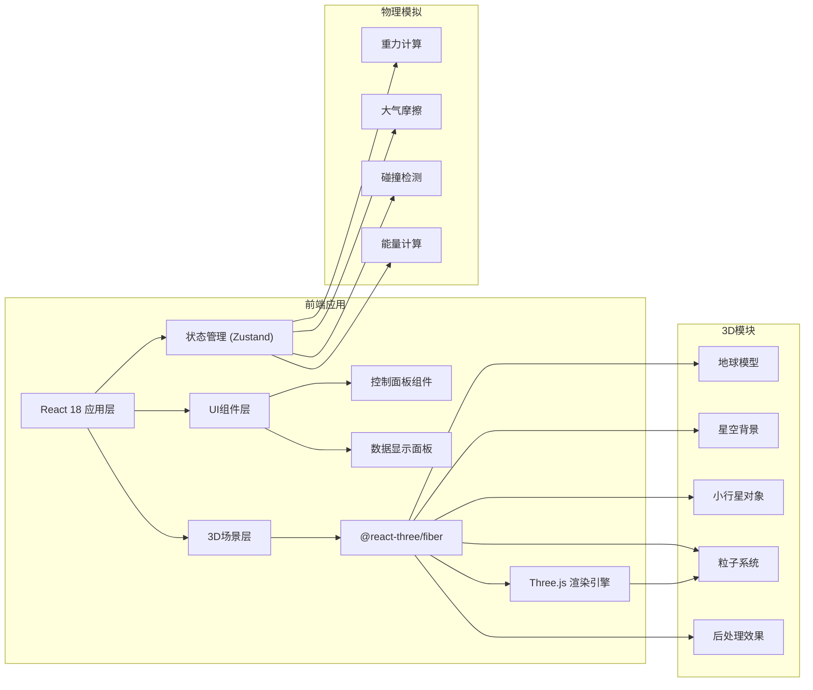

## 1. 架构设计



## 2. 技术选型

- **前端框架**: React@18 + TypeScript
- **构建工具**: Vite@5
- **样式方案**: TailwindCSS@3
- **3D引擎**: Three.js@0.160
- **React Three绑定**: @react-three/fiber@8
- **3D工具库**: @react-three/drei@9
- **后处理效果**: @react-three/postprocessing@2
- **状态管理**: Zustand@4
- **物理计算**: 自定义简化物理引擎（无需完整物理引擎，使用牛顿力学公式）

## 3. 项目结构

```
src/
├── components/
│   ├── ControlPanel/       # 控制面板组件
│   │   ├── ParameterSlider.tsx
│   │   └── index.tsx
│   ├── DataPanel/          # 数据显示面板
│   │   └── index.tsx
│   └── Scene3D/            # 3D场景组件
│       ├── Earth.tsx       # 地球模型
│       ├── Stars.tsx       # 星空背景
│       ├── Asteroid.tsx    # 小行星
│       ├── Atmosphere.tsx  # 大气层
│       ├── Crater.tsx      # 陨石坑
│       ├── Particles.tsx   # 粒子系统
│       └── index.tsx
├── store/
│   └── useSimulationStore.ts  # 状态管理
├── utils/
│   ├── physics.ts          # 物理计算工具
│   └── constants.ts        # 物理常量
├── types/
│   └── index.ts            # TypeScript类型定义
├── App.tsx
├── main.tsx
└── index.css
```

## 4. 核心数据模型

### 4.1 模拟状态

```typescript
interface SimulationState {
  // 小行星参数
  asteroid: {
    size: number;           // 直径 (米)
    mass: number;           // 质量 (吨)
    velocity: number;       // 初始速度 (km/s)
    angle: number;          // 入射角度 (度)
    position: Vector3;      // 当前位置
    velocityVector: Vector3;// 速度向量
    isLaunched: boolean;    // 是否已发射
    isBurning: boolean;     // 是否在燃烧
    burnIntensity: number;  // 燃烧强度 0-1
  };
  
  // 模拟状态
  status: 'idle' | 'dragging' | 'flying' | 'impact' | 'finished';
  time: number;             // 模拟时间
  
  // 撞击结果
  impact: {
    occurred: boolean;
    energy: number;         // 撞击能量 (焦耳)
    craterDiameter: number; // 陨石坑直径 (公里)
    tntEquivalent: number;  // TNT当量 (吨)
    position: Vector3;      // 撞击点
  };
  
  // 操作方法
  setAsteroidParams: (params: Partial<AsteroidParams>) => void;
  launch: () => void;
  reset: () => void;
  updateSimulation: (delta: number) => void;
}
```

### 4.2 物理常量

```typescript
const PHYSICS_CONSTANTS = {
  EARTH_RADIUS: 6371,       // 地球半径 (公里) - 缩放后用于3D场景
  EARTH_MASS: 5.972e24,     // 地球质量 (kg)
  GRAVITY_CONSTANT: 6.674e-11, // 万有引力常数
  ATMOSPHERE_HEIGHT: 100,   // 大气层高度 (公里)
  ASTEROID_DENSITY: 3000,   // 小行星密度 (kg/m³)
  DRAG_COEFFICIENT: 0.47,   // 阻力系数
  HEAT_OF_VAPORIZATION: 8e6, // 汽化热 (J/kg)
};
```

## 5. 路由定义

| 路由 | 页面 | 描述 |
|------|------|------|
| / | 主模拟页面 | 3D场景 + 控制面板 + 数据面板 |

## 6. 核心计算逻辑

### 6.1 撞击能量计算
```
动能 = 0.5 × 质量 × 速度²
质量 = 密度 × (4/3) × π × (直径/2)³
TNT当量 = 能量 / 4.184e9 (1吨TNT = 4.184×10⁹焦耳)
```

### 6.2 陨石坑直径计算
```
陨石坑直径 ≈ 1.8 × (能量)^(0.29) × (重力加速度)^(-0.17) × (目标密度)^(-0.22)
(经验公式，基于陨石坑形成的统计数据)
```

### 6.3 大气摩擦减速
```
阻力 = 0.5 × 空气密度 × 速度² × 阻力系数 × 横截面积
加速度 = 阻力 / 质量
```

### 6.4 燃烧强度
```
燃烧强度 ∝ 速度³ × 空气密度
当速度 > 2km/s 且在大气层内时开始燃烧
```

## 7. 性能优化

1. **3D性能**
   - 使用InstancedMesh处理星空粒子
   - 粒子系统使用BufferGeometry
   - 限制最大粒子数量为2000
   - 燃烧粒子使用对象池复用

2. **渲染优化**
   - 后处理效果按需启用
   - 小行星燃烧时才添加点光源
   - 使用PixelRatio限制渲染分辨率

3. **物理计算**
   - 使用requestAnimationFrame固定时间步长
   - 碰撞检测使用简单的球面距离判断
